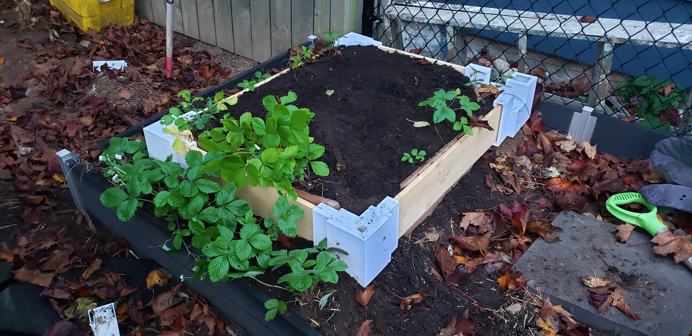
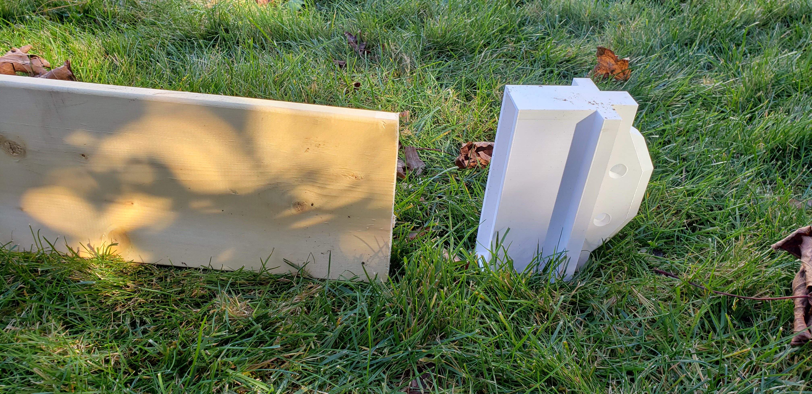
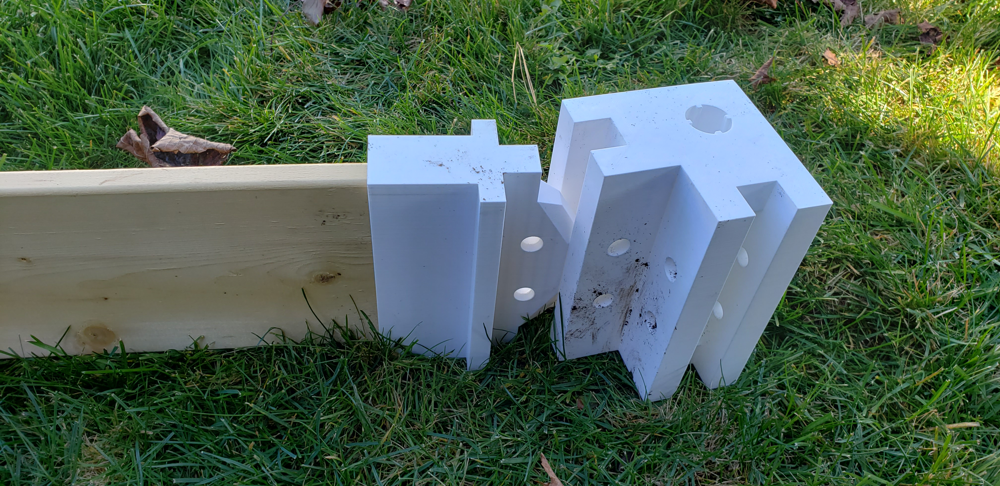
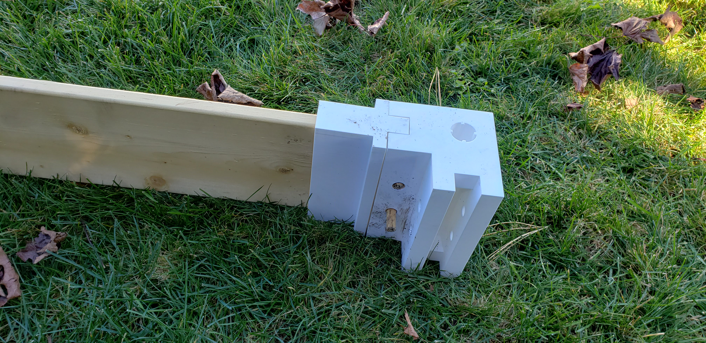

# garden-edge-boards
A self-contained OpenSCAD repository with a framework for arranging garden edge boards, such as for raised beds.

## Core Components
The main elements in the framework are the board holder, the tongue and groove attachments for board holders, and the posts.

### Board Holder
The board holder is a press-fitting sheath for a board that can be used to connect to an assembly. The original board holder has a connector backing with a tongue that can be connected with dowels.

### Tongue and Groove
The tonque and groove mating system connect using dowels and form a stable assembly. Normally the groove will be embedded in a post or a similar structure.

### Post Assemblies
Post assemblies contain one or more grooves as well as a central connector conduit that may be used to fasten them to the ground. In the initial iteration these grooves must be separated by 90 degree angles. The post assemblies may be encased in shells to keep the internal connections clean.

## Released Iterations

### v0.0.1 (Initial)
The [initial iteration](./docs/v0.0.1.md) of the garden-edge-boards introduces the base components necessary to build a simple right-angles raised bed using 1-by-6s.

The initial iteration is undergoing [testing](./docs/strawberry_test_bed.md) in a simple square configuration in USDA hardiness zone 6B.

## Planned Iterations

### v0.0.2
The second iteration will be used to fix any issues arising during testing of v0.0.1, and will add a small set of features.

Features include:
- Non-right-angle connections for posts
- Multiple board size configuration presets
- Mating components for connector conduits
- Support for stacking multiple layers
