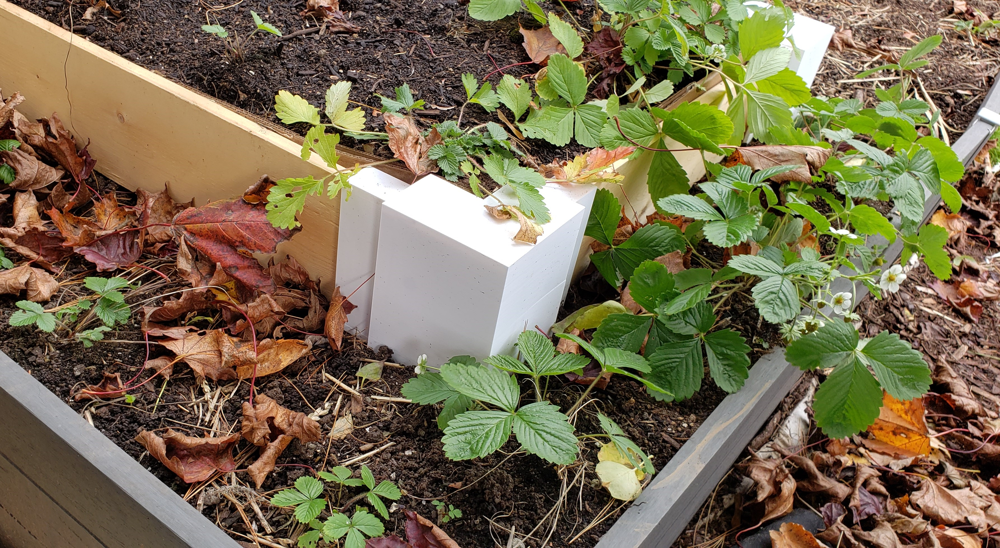

# strawberry-test-bed

The strawberry test bed is a multi-tier stepped pyramid of strawberries, with the top two tiers build from the garden-edge-boards. The v0.0.1 lower tier was put in place on Oct 24th, 2024.

## v0.0.1 Lower Tier Setup

The lower tier is created using the v0.0.1 size defaults. One post is created from the original blender experimental model and the remaining three are created from the v0.0.1 source. The components are all printed on a Prusa Mk4 with default configurations, using Hatchbox White PLA. All models are sliced with PrusaSlicer using a default Mk4 configuration and 0.15mm quality presets.

Several other attributes are varied between corners:
- Shells are present on two of the three corners under test
- Two of the three corners are hollow fill strategy and the other is braced fill strategy
- Two of the corners are fastened with rebar, one is fastened with a dowel

## Concerns / Items to watch for
- Water ingress in the corners without shells may cause issues with freezing
- The 1 by 6 boards are untreated and should be checked for degredation
- Some of side walls are backed with cardboard and others are not, so the impact on lifespan of the boards may be observed

## v0.0.1 Lower Tier Updates

Oct 24th, Initial Setup -
- Overall setup went smoothly with all parts fitting on first attempt
- Boards fit very tightly on Z axis, this may be a concern for splitting with freezing
