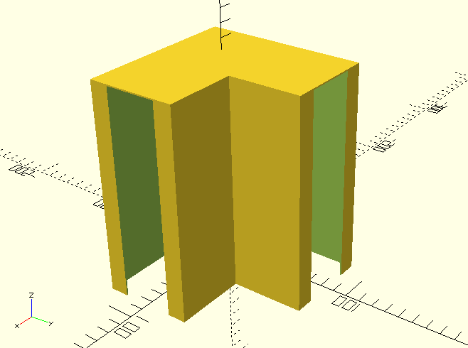

# v0.0.1

This initial release provides the necessary components for a minimum viable product style test. The release coincides with the creation of the v0.0.1 [strawberry test bed](./strawberry_test_bed.md) lower tier. This long-term test will have periodic updates made with details on results.

The following components are included in this release:
 - Board Holder Tongue
 - Right-angle Grooved Post
 - Simple Outer Shell

## Board Holder Tongue

The board holder tongue is the element that press-fits onto the end of a board and then mates with a grooved component.

The board-side connector has a narrowing mouth to improve board insertion, and the tongue-side is fastened into the groove using dowels inserted laterally through the tongue and groove.

## Grooved Post

The grooved post accepts and secures tongued board holders and allows itself to be fastened to the ground via a rod placed through its connector conduit.

The conduit where the stake is inserted tapers to a larger opening on the top and bottom. The mouth on each of the top and bottom surfaces have mating teeth that may be used for capping the stake without a shell, stacking multiple layers of grooved posts, and/or affixing additional components.

The grooves each have lateral holes to allow insertion of dowels to fasten the tongues in place.

## Assembly Shell

The assembly shell is a simple outer covering that may be placed over the posts and board holders once the components are connected. It keeps dust and debris out of the connection mechanisms and reduces the amount of water that enters the system.

## Notes

So far this model is provided for-but-not-with mating components via the connector conduit.

A blender file (resources/v0.0.1/1by6BoardEdge.blend) is included as a reference. This file contains an experimental model used to perform some size tests before the OpenSCAD content was created. It also contains some miscellaneous models used for inspection and comparison.

## Known Items to Address

This iteration contains a few areas with known paths to improvement:

General Size Selection -
The sizes of all components was done in a quick, easy, safe way. Sizes may be further optimized to reduce the amount of material needed.

Size Presets -
This iteration has all values defined to work with 1-by-6 boards and 3/8" dowels. Additional size presets may be added.

Dowel Coupling Mechanisms Require Push -
Currently removing the pin-dowels requires the user to push them through with another dowel or object. A feature allowing them to be pulled out with plier or similar would allow the mechanisms to be kept cleaner.
